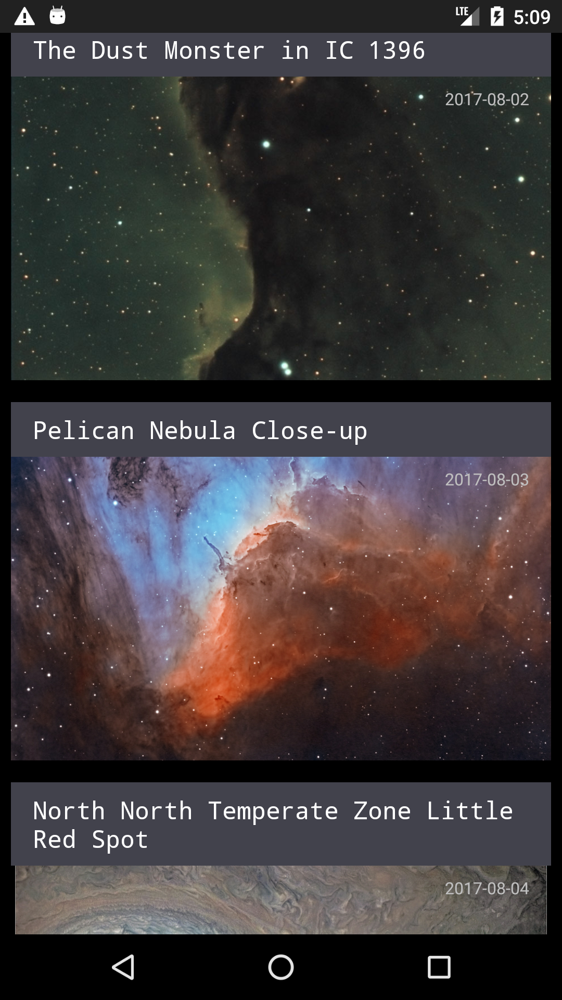
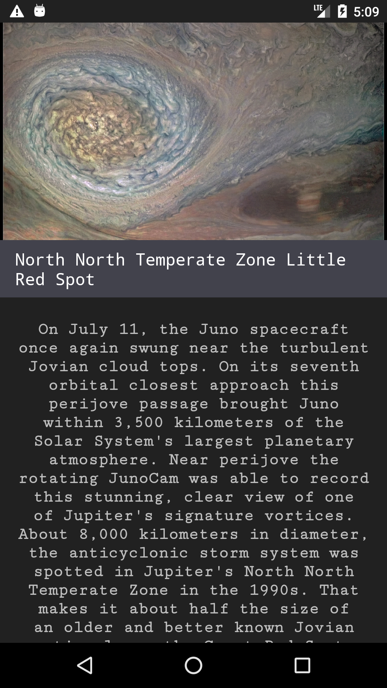

[mvvm]: apod_mvvm.png "KApod MVVM"

KApod
=====

Basic demo to show an architecture following
[Android Architecture Components](https://maven-badges.herokuapp.com/maven-central/com.github.bumptech.glide/glide/badge.svg)

## KApod MVVM Architecture
An MVVM example written in Kotlin.

import Room, LiveData, Dagger 2 and RxJava2
![alt text][mvvm]

|   |   |
